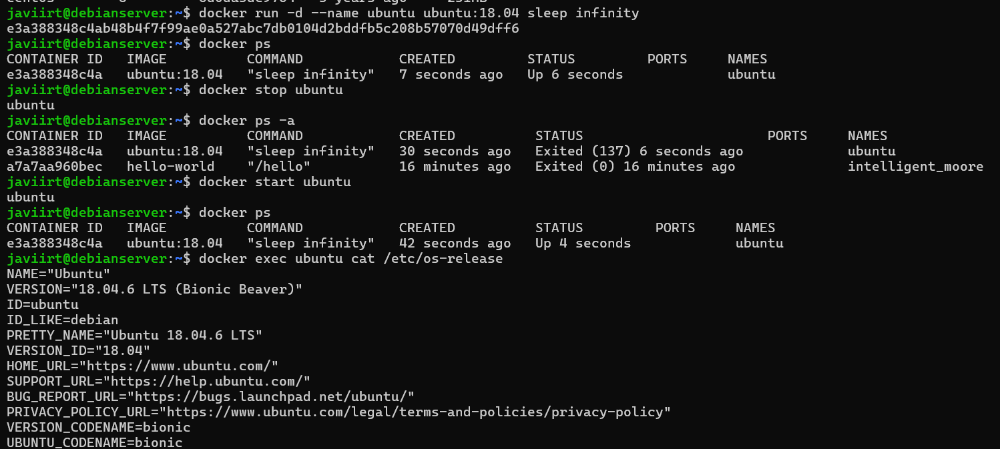

# ARRANCAR UN CONTENEDOR

En esta tarea vas a arrancar un contenedor al que llamaremos ubuntu, de la imagen ubuntu:18.04. Una vez arrancado realizar las siguientes operaciones:

- Salir del contenedor y comprobar que ese contenedor se ha parado.
- Rearrancar el contenedor desde tu equipo y comprobar que está funcionando.
- Sin entrar en el contenedor, mostrar por pantalla el fichero /etc/os-release.

## Requisitos
- Grabacion en asciinema

### Solución
