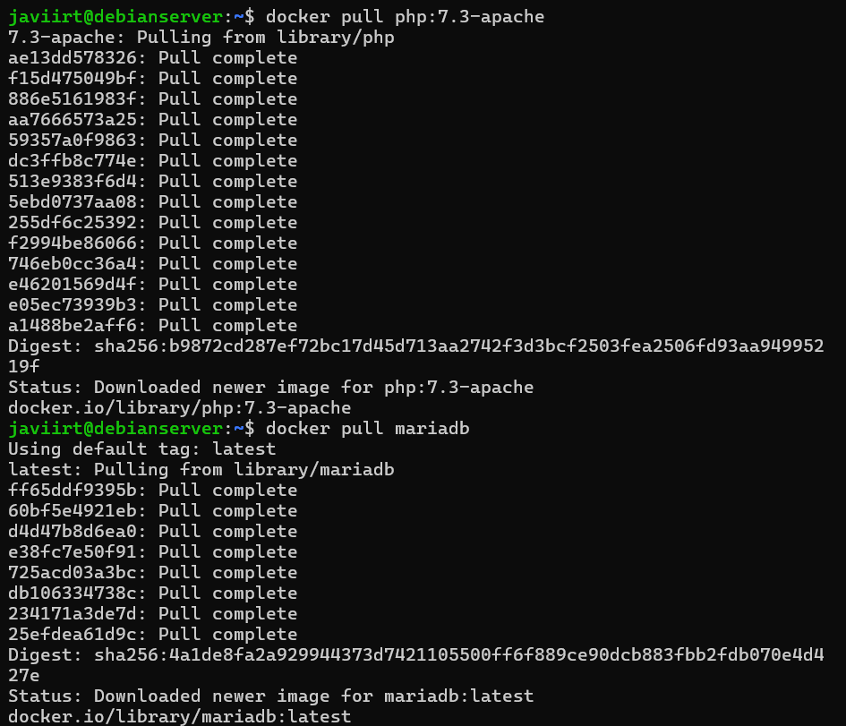
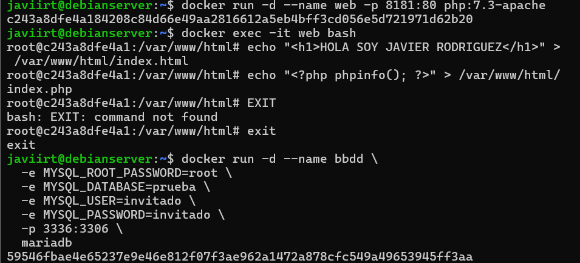
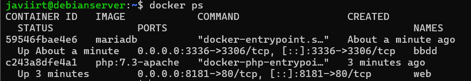
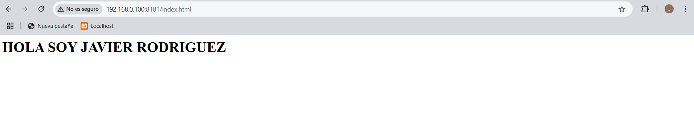
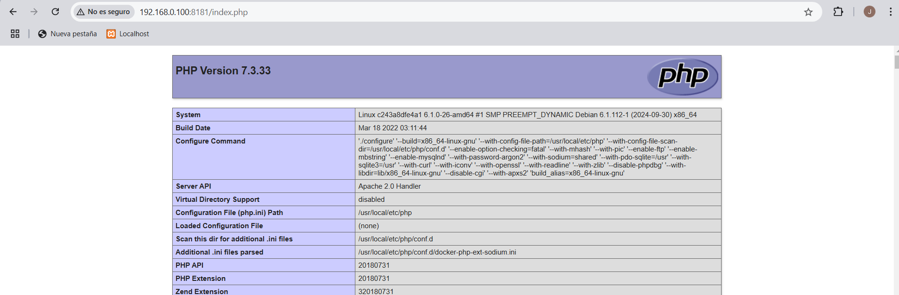

# EJECUCIÓN DE SERVICIOS DESDE CONTENEDORES

En esta tarea vas a ejecutar varios servicios web y de bases de datos sobre contenedores.

- Arranca un contenedor que ejecute una instancia de la imagen php:7.3-apache, que se llame web y que sea accesible desde tu equipo en el puerto 8181.
- Colocar en el directorio raíz del servicio web de dicho contenedor un fichero llamado index.html con el siguiente contenido: &lt;h1>HOLA SOY XXXXXXXXXXXXXXX &lt;/h1> NOTA: Deberás sustituir XXXXXXXXXXX por tu nombre y tus apellidos.

- Colocar en ese mismo directorio raíz un archivo llamado index.php con el siguiente contenido: &lt;?php phpinfo(); ?>

- Arrancar un contenedor que se llame bbdd y que ejecute una instancia de la imagen mariadb para que sea accesible desde el puerto 3336.

- Antes de arrancarlo visitar la página del contenedor en Docker Hub (https://hub.docker.com/_/mariadb) y establecer las variables de entorno necesarias para que:
    - La contraseña de root sea root.
    - Crear una base de datos automáticamente al arrancar que se llame prueba.
    - Crear el usuario invitado con la contraseña invitado.

## Requisitos
- Grabacion en asciinema

### Solución

