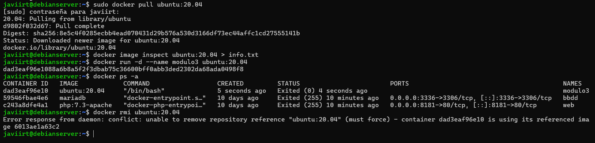
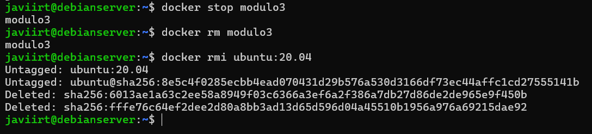

# GESTIÓN DE IMÁGENES

- Descargar la imagen Ubuntu:20.04 desde Docker Hub.
- Obtener toda la información de esa imagen y volcarla el fichero info.txt.
- Instanciar esa imagen creando un contenedor llamado modulo3. 
- Usar el comando docker adecuado para comprobar que efectivamente ese contenedor se ha creado (en ejecución o no).
- Intentar borrar la imagen Ubuntu:20.04. ¿Has podido borrar la imagen? Responde razonadamente.
- Realizar las operaciones necesarias para poder borrar la imagen. 

## Requisitos
- Razonamiento
- Grabacion en asciinema

### Solución

#### ¿Has podido borrar la imagen? Responde razonadamente.
El error al intentar eliminar la imagen porque tengo un contenedor (modulo3) basado en esa imagen. Docker no permite eliminar una imagen si hay contenedores en ejecución o detenidos que la están usando.

