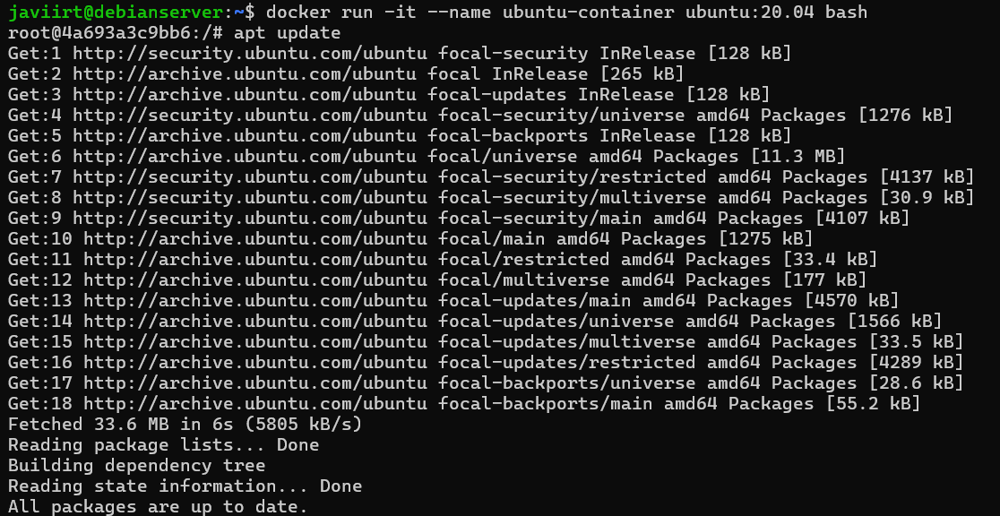
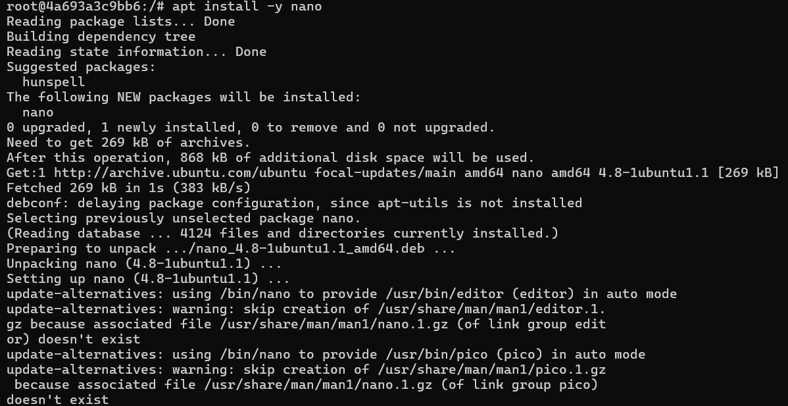
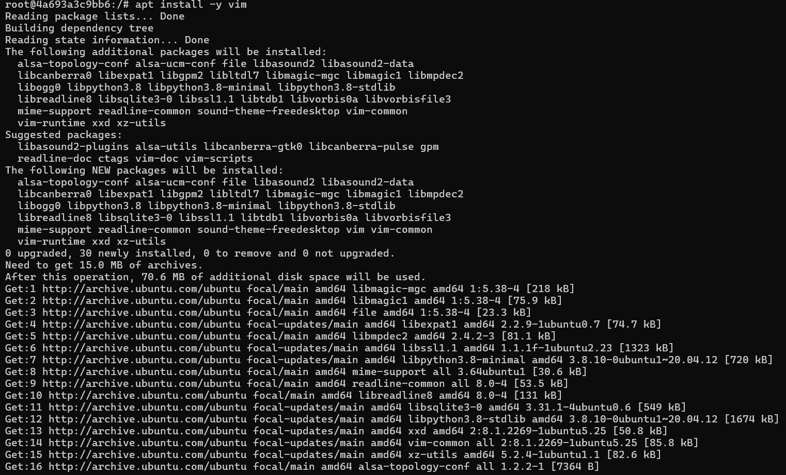
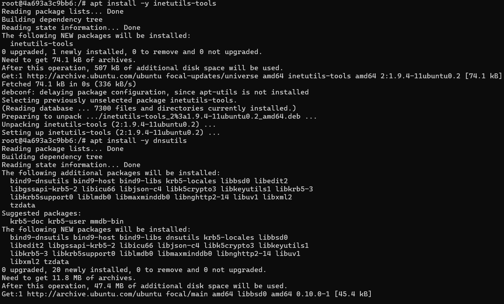
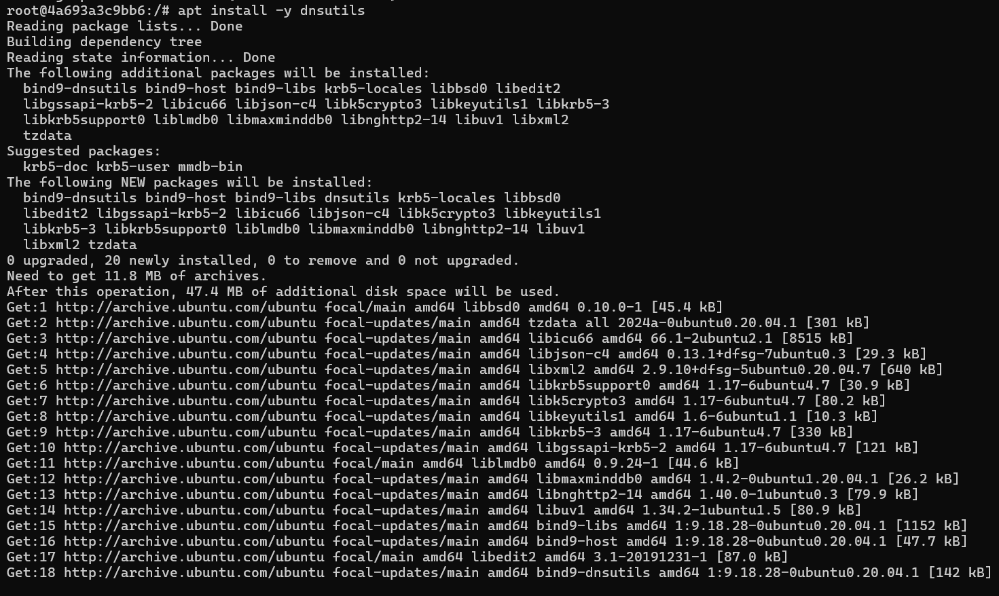
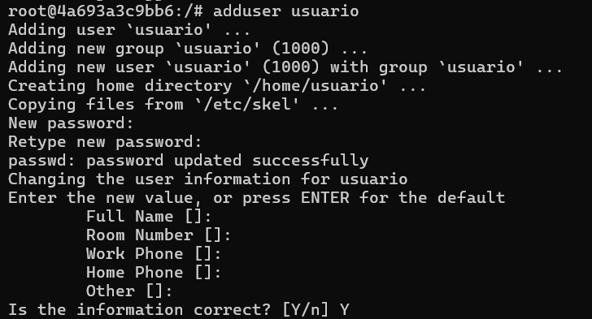
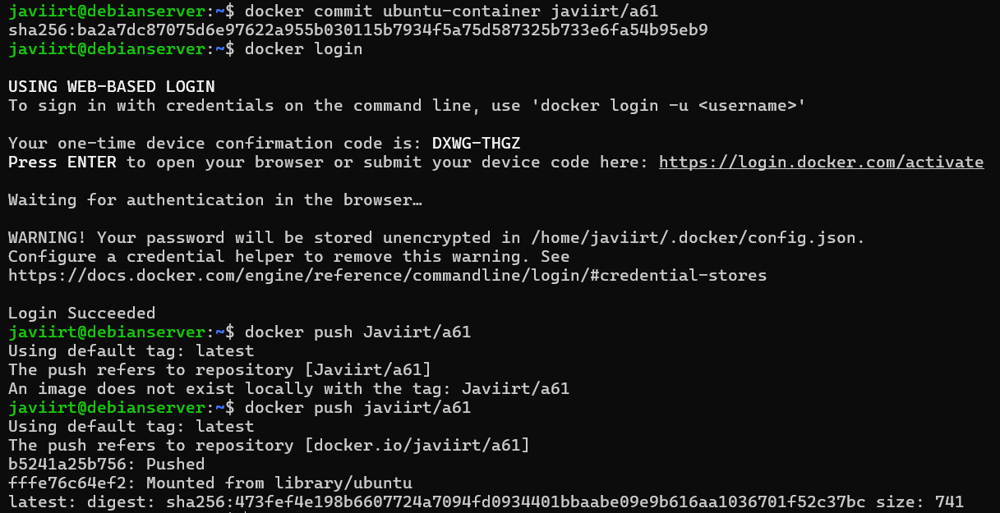
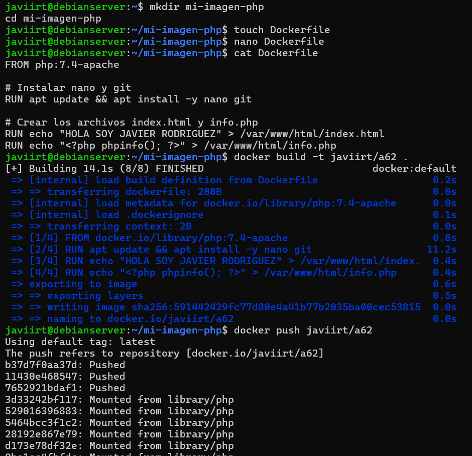
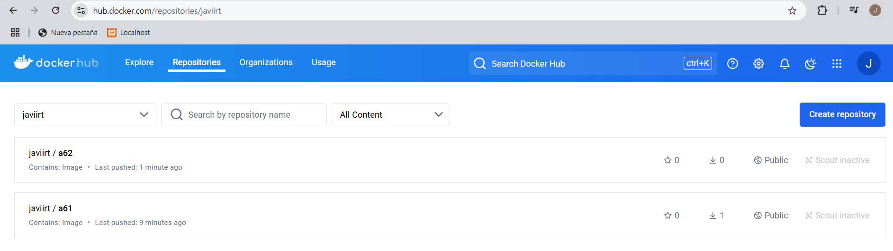

# DOCKERFILE

## 1a Parte

1. Arrancar un contenedor sobre la imagen ubuntu:20.04 y sobre él realizar las siguientes operaciones:

    - Instalación del editor nano (apt install nano).
    - Instalación del editor vim (apt install vim).
    - Instalación de las herramientas de red (apt install inetutils-tools).
    - Instalación de las herramientas dns (apt install dnsutils).
    - Creación del usuario usuario con contraseña usuario (adduser usuario)

2. Tras realizar dichas instalaciones y utilizando la orden docker commit crear una imagen que se llame de la siguiente manera: TuNombreUsuarioDockerHub/a61 y subirla a DockerHub utilizanzo la orden docker push. Recordad que antes tendréis que hacer docker login.

## 2a Parte

1. Partiendo de la imagen php:7.4-apache construir un Dockerfile que realice lo siguiente:
    - Instalar nano (apt install -y nano)
    - Instalar git (apt install -y git)
    - Colocar en el directorio raíz del servidor apache (/var/www/html) dos ficheros:
        - index.html que contenga HOLA SOY XXXXXX sustituyendo XXXXX por tu nombre
        - info.php que contengo el siguiente código &lt;? php phpinfo(); ?>

2. Una vez creado dicho Dockerfile construir la imagen, que se deberá llamar TuNombreUsarioDockerHub/a62.

### Solución Parte 1 

### Solución Parte 2 

