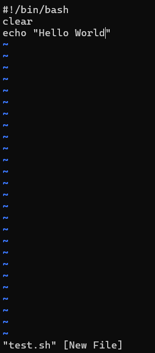
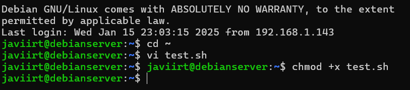
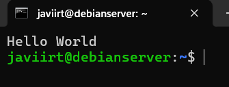
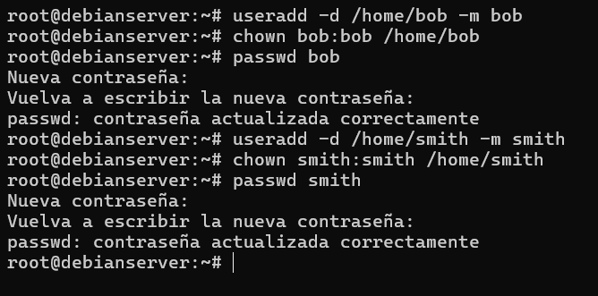
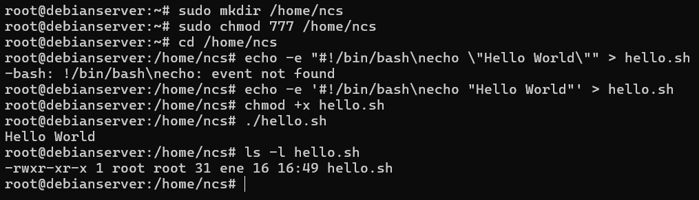
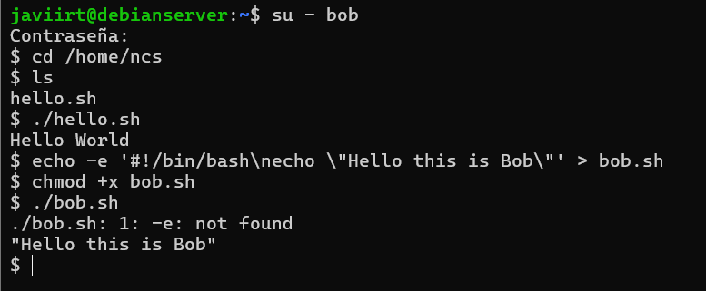
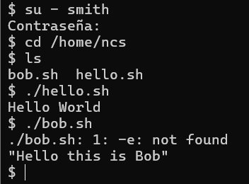
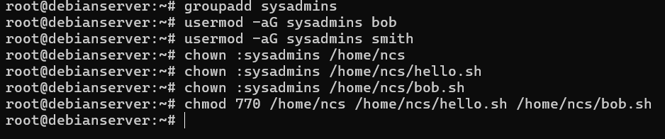
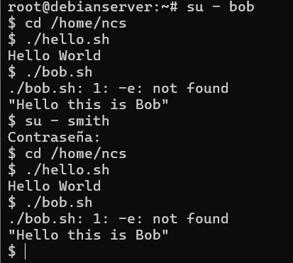
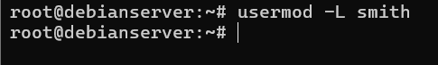

# Linux Systems and Shell Scripting Exercises

## **Exercise 3.1: Creating an Executable Bash Script**

### **Enunciado**
1. Using `vi` (or another terminal text editor such as `emacs`), create a script called `test.sh` in your home directory with the following contents:
   ```bash
   #!/bin/bash
   clear
   echo "Hello World"
   ```
   
2. Make sure the script is executable, then run it by executing: `./test.sh`.

3. A student executed the following command:
   ```bash
   chmod 777 test.sh
   ```
   Explain why giving 777 permissions to a file is a bad idea.

### **Comandos Usados**






El comando "chmod 777 test.sh" da permisos de lectura, escritura y ejecución a todos los usuarios (propietario, grupo y otros). Esto es problemático porque:
- Cualquier usuario del sistema puede modificar y ejecutar el archivo, lo que puede resultar en alteraciones o uso malicioso.
- Los usuarios podrían modificar el archivo sin intención, causando fallos en el script.
- Es innecesario y no sigue el principio de mínimos privilegios.

En su lugar, es mejor usar chmod +x para darle permisos de ejecución solo al propietario, o permisos más específicos según sea necesario (como chmod 754).

---

## **Exercise 3.2: Creating New Users**

### **Enunciado**
Create two new user accounts:
- Username: `bob`, Password: `bob`
- Username: `smith`, Password: `smith`

### **Comandos Usados**



---

## **Exercise 3.3: Creating a Shared Executable Script**

### **Enunciado**
1. Create a publicly readable and writable directory with the path `/home/ncs` and set the appropriate permissions.
2. Create a bash script in this directory called `hello.sh` which should print a message saying "Hello World".
3. Execute this script.
4. Note down the owner/group ownerships and the file permissions of this script.

### **Comandos Usados**


---

## **Exercise 3.4: Accessing Files from Different User Accounts**

### **Enunciado**
#### Parte a) Log in as `bob`:
1. Navigate to the directory `/home/ncs`. What do you see in this directory?
2. Execute `./hello.sh`. Does it succeed? Why (not)?
3. Create a script called `bob.sh`, which should print the message "Hello this is Bob" when executed.
4. Execute `./bob.sh` and explain the result you get.

#### Parte b) Log in as `smith`:
1. Navigate to the directory `/home/ncs`. What do you see in this directory?
2. Execute `./hello.sh` and `./bob.sh`. Explain the results you get.

### **Comandos Usados**

#### Parte a: Bob

1. Se ven los archivos presentes en el directorio, por ejemplo, hello.sh y cualquier otro archivo creado anteriormente.

2. Sí, debería ejecutarse correctamente si el archivo tiene permisos de ejecución (chmod +x hello.sh) y permisos adecuados de lectura/escritura para bob.
3. El archivo bob.sh debe crearse y hacerse ejecutable con chmod +x. Esto se puede verificar ejecutando ls -l bob.sh.
4. Si bob.sh tiene permisos de ejecución, se imprimirá el mensaje "Hello this is Bob". Si no, aparecerá un error de permisos.

#### Parte b: Smith

1. Se ven los mismos archivos que en la cuenta de bob, como hello.sh y bob.sh, ya que el directorio es público.
2. Ejecución:
   `./hello.sh`: Debería ejecutarse correctamente si tiene permisos públicos de lectura y ejecución.
    `./bob.sh`: Si `bob.sh` no tiene permisos de lectura/ejecución para otros usuarios, aparecerá un error de permisos. Para que `smith` pueda ejecutarlo, `bob.sh` debe tener permisos adecuados, como `chmod 755 bob.sh`.


---

## **Exercise 3.5: Optional Exercises**

### **Enunciado**
1. Create a group called `sysadmins`, and add `bob` and `smith` as members. Change the group owner of `/home/ncs`, `/home/ncs/hello.sh`, and `/home/ncs/bob.sh` to this group. Verify if both `bob` and `smith` can execute both scripts now.
2. Disable `smith`'s user account without deleting it or its files.

### **Comandos Usados**

#### Creación del grupo y añadir miembros



#### Verificar acceso como bob y smith



#### Deshabilitar smith

