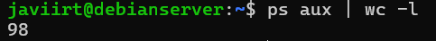

### **Exercise 4.1: Exploring currently running processes**

#### **Enunciado:**
1. Find out the total number of processes currently running.
2. Identify the 10 most CPU-intensive processes and give a brief description of what each of them does.

#### **Respuesta:**
1. Find out the total number of processes currently running.

   

2. Identify the 10 most CPU-intensive processes and give a brief description of what each of them does.

   

- ps aux --sort=-%cpu : Muestra una lista de los procesos en ejecución, ordenados por el uso de CPU. 
- [kworker/1:1-events] : Proceso del kernel que maneja eventos de hardware en la CPU 1.
- /usr/bin/dockerd -H fd:// --containerd=/run/containerd/containerd.sock : Demonio de Docker, gestiona contenedores y sus operaciones.
- [kworker/1:4-events] : Proceso del kernel que maneja eventos de hardware en la CPU 1.
- [kworker/u4:2-ext4-rsv-conversion] : Proceso del kernel que maneja la conversión de reservas en sistemas de archivos ext4.
- /usr/bin/containerd : Servicio que ejecuta y gestiona contenedores en Docker.
- /sbin/init : Primer proceso iniciado en el sistema, responsable de iniciar otros procesos.
- [migration/1] : Proceso que maneja la migración de tareas entre CPUs.
- [kworker/0:1H-kblockd] : Proceso del kernel que maneja bloqueos y eventos relacionados en la CPU 0.
- /usr/sbin/named -f -u bind : Servicio de DNS, parte del servidor BIND (Berkeley Internet Name Domain).

---

### **Exercise 4.2: Exploring network processes**

#### **Enunciado:**
1. Execute `nmap localhost`. Write down all processes returned and explain their purpose.

#### **Respuesta:**

- 22/tcp (ssh): Para acceso remoto seguro a tu máquina.

- 80/tcp (http): Para servicios web y páginas web.

- 8181/tcp (intermapper): Para monitoreo de red.

---

### **Exercise 4.3: Exploring UNIX signals**

#### **Enunciado:**
1. Execute `kill -l` and summarize the signals (numbers 1–9 and 5 more between 10–31).

#### **Respuesta:**

| Número | Señal  | Descripción                                                     |
|--------|--------|-----------------------------------------------------------------|
| 1      | SIGHUP | Hang up (desconexión)                                           |
| 2      | SIGINT | Interrupt (interrupción desde el teclado, Ctrl+C)               |
| 3      | SIGQUIT| Quit (salida)                                                   |
| 4      | SIGILL | Illegal Instruction (instrucción ilegal)                        |
| 5      | SIGTRAP| Trace/Breakpoint Trap (trampa de rastreo/punto de interrupción) |
| 6      | SIGABRT| Abort (aborto)                                                  |
| 7      | SIGBUS | Bus Error (error de bus)                                        |
| 8      | SIGFPE | Floating Point Exception (excepción de punto flotante)          |
| 9      | SIGKILL| Kill (matar el proceso, no se puede capturar ni ignorar)        |
| 10     | SIGUSR1| User-defined signal 1 (señal definida por el usuario 1)         |
| 11     | SIGSEGV| Segmentation Fault (fallo de segmentación)                      |
| 12     | SIGUSR2| User-defined signal 2 (señal definida por el usuario 2)         |
| 13     | SIGPIPE| Broken Pipe (tubería rota)                                      |
| 14     | SIGALRM| Alarm Clock (alarma)                                            |
| 15     | SIGTERM| Termination (terminación)                                       |

---

### **Exercise 4.4: Processes and networking**

#### **Enunciado:**
1. Enable FTP and Telnet in `/etc/inetd.conf`. Restart `inetd`. Test with `ftp localhost` and `telnet localhost`.
2. Disable FTP in `/etc/inetd.conf`, restart `inetd`, and test.
3. What are SFTP and SSH? Why is Telnet discouraged in real-world usage?

#### **Respuesta:**

- SFTP (Secure File Transfer Protocol): Protocolo seguro de transferencia de archivos usando una conexión SSH. Encripta comandos y datos, ofreciendo mayor seguridad que FTP.

- SSH (Secure Shell): Protocolo que permite acceso remoto seguro a dispositivos y servidores. Encripta el tráfico para prevenir interceptaciones.

- Telnet: Permite conexiones remotas pero no encripta datos, lo que lo hace inseguro. Se prefiere SSH en entornos seguros.

---

### **Exercise 4.5: Optional Exercises**

#### **Enunciado:**
1. Combine `pidof` with `kill -HUP` to restart `inetd` in one command.
2. Can you FTP as root? Is it advisable? Why (or why not)?

#### **Respuestas:**
1. Restart `inetd` in one command:

2. Es posible pero no recomendable debido a los altos riesgos de seguridad. El FTP transmite datos sin cifrar, lo que expone las credenciales raíz.

     
