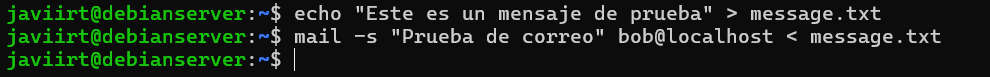
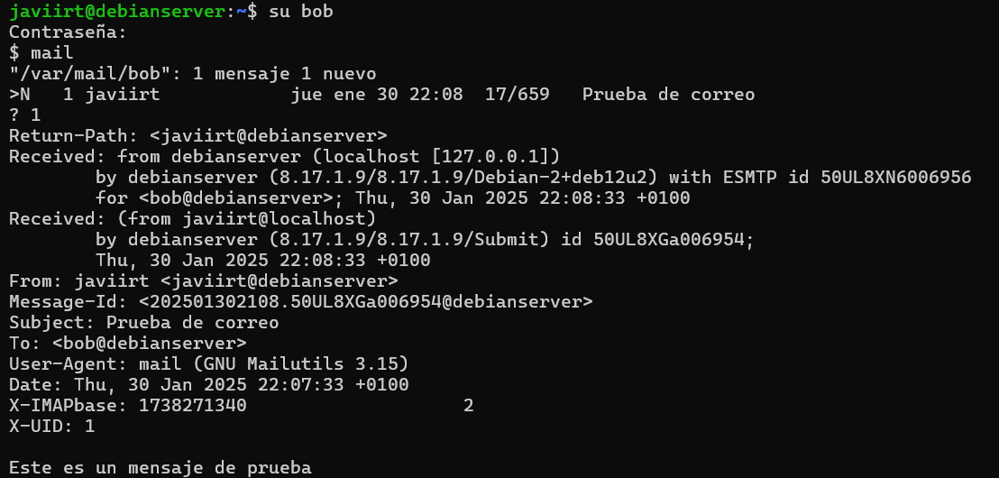
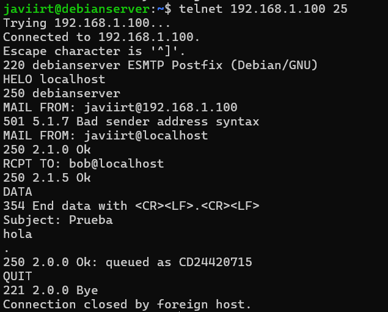
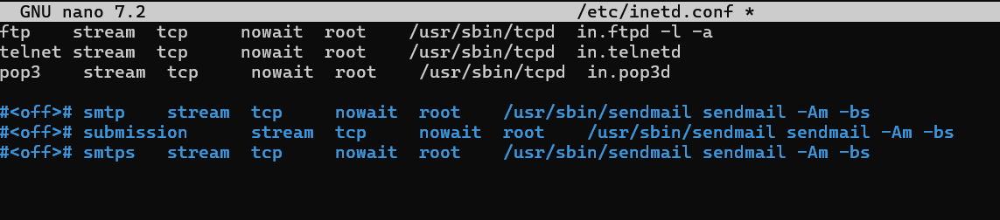
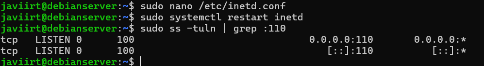
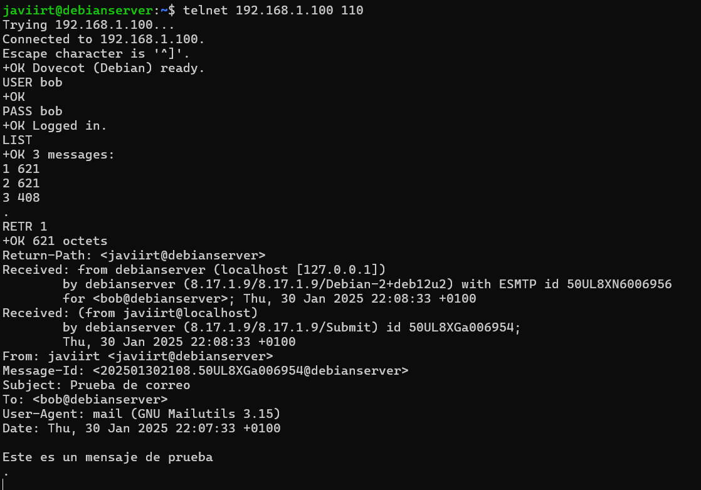

# Email under Linux: Actividades y Respuestas

## **Ejercicio 6.1: Envío de correos usando `mail`**
1. **Crea un archivo llamado `message.txt` con texto, luego redirígelo al comando `mail` para enviarlo a bob.**

### **Respuesta:**

2. **Explica qué hace el siguiente comando:**

echo "Welcome to Network Computer Systems" | mail -s "Hello world" bobanglia.bryant -c smithanglia.bryant -b rootanglia.bryant

### **Respuesta:**
Este comando envía un correo con el asunto "Hello world" y el cuerpo del mensaje "Welcome to Network Computer Systems". 
- El correo se envía a `bobanglia.bryant`.
- Se envía una copia al destinatario `smithanglia.bryant` (Cc).
- Se envía una copia oculta al destinatario `rootanglia.bryant` (Bcc).

---

## **Ejercicio 6.2: Comprobando correos**
**Inicia sesión como bob y verifica que todos los correos enviados a bob están presentes.**

### **Respuesta:**

---

## **Ejercicio 6.3: Explorando `mail`**
**Realiza las siguientes tareas como el usuario bob:**

1. Describe cómo leer, responder, enviar, borrar, listar y guardar mensajes usando `mail`.
2. ¿Qué contiene el directorio `/var/spool/mail/`? ¿Cuáles son las implicaciones de seguridad?
3. Desde la máquina Windows, usa `telnet` para enviar un mensaje a `boblocalhost` desde `tu_nombrelocalhost`.
4. Habilita POP3 y explica cómo hacerlo.
5. Usa `telnet` para explorar el servidor POP3 en tu máquina virtual.
6. ¿Qué puertos usan SMTP y POP3?

### **Respuesta:**

1. **Uso de `mail`:**
   - Leer: Ejecuta `mail` y selecciona un número de mensaje.
   - Responder: Dentro de `mail`, escribe `r <número del mensaje>`.
   - Enviar: Usa `mail -s "Asunto" destinatario`.
   - Borrar: Escribe `d <número del mensaje>`.
   - Listar: Usa el comando `mail`.
   - Guardar: Escribe `s <número del mensaje> <archivo_destino>`.

2. **Contenido de `/var/spool/mail/`:**
   Este directorio contiene los correos de los usuarios almacenados en archivos con sus nombres. La seguridad es crucial, ya que estos archivos pueden ser leídos si las configuraciones de permisos no son adecuadas.

3. **Enviar un correo usando Telnet en SMTP:**

4. **Habilitar POP3:**
Edita el archivo `/etc/inetd.conf` y descomenta la línea relacionada con POP3. Luego, reinicia `inetd`:

5. **Explorar POP3:**
Conéctate al puerto 110 mediante Telnet:

6. **Puertos usados por SMTP y POP3:**
- SMTP: Puerto 25.
- POP3: Puerto 110.

---

## **Ejercicio 6.4: Ejercicios Opcionales**

1. **¿Qué es IMAP? Lista las diferencias entre POP3 e IMAP.**

### **Respuesta:**
IMAP (Internet Message Access Protocol) permite acceder y gestionar correos almacenados en un servidor de forma remota. 
**Diferencias con POP3:**
- IMAP sincroniza correos entre cliente y servidor; POP3 los descarga al cliente y los elimina del servidor.
- IMAP permite carpetas en el servidor; POP3 no.
- IMAP es mejor para múltiples dispositivos; POP3 está diseñado para un único dispositivo.

2. **¿Qué es PGP? ¿Cómo funciona?**

### **Respuesta:**
PGP (Pretty Good Privacy) es un sistema de cifrado que protege la confidencialidad e integridad de los correos. Utiliza:
- **Cifrado de clave pública:** Los mensajes se cifran con la clave pública del destinatario y solo pueden ser descifrados con su clave privada.
- **Firmas digitales:** Garantizan que el mensaje no ha sido alterado.

