# Email under Linux: Actividades y Respuestas

## **Ejercicio 7.1: Configuración de Apache**

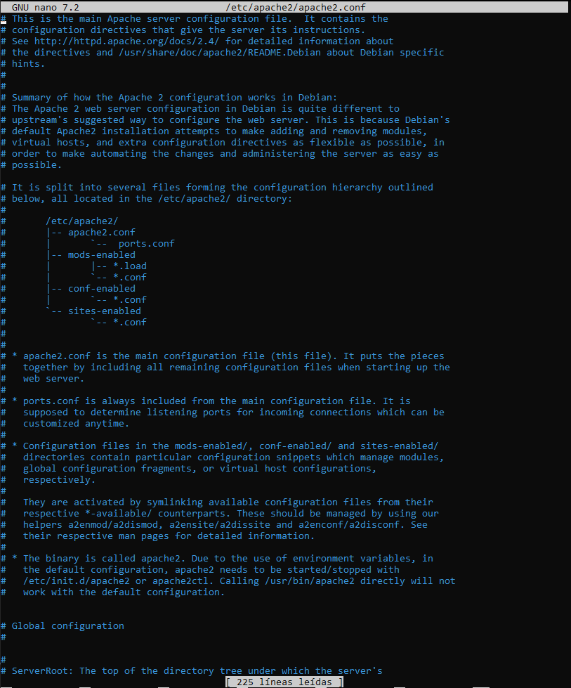

1. **Las líneas que comienzan con # son comentarios. ¿Cuál es su propósito?**

   #### **Respuesta:**
   Las líneas que comienzan con `#` son comentarios y se utilizan para proporcionar información o descripciones sobre la configuración dentro del archivo `httpd.conf`. No afectan la ejecución de Apache.

2. **Encuentra los valores predeterminados de `ServerName` y `DocumentRoot` y anótalos. ¿Qué hacen/significan?**

   #### **Respuesta:**
   - `ServerName`: Especifica el nombre del servidor, que puede ser un dominio o una dirección IP.
   - `DocumentRoot`: Define la ruta del directorio donde se almacenan los archivos web que Apache servirá.

3. **Descomenta la línea `Include /etc/httpd/mod_php.conf`. ¿Qué hace esto?**

   #### **Respuesta:**
   Permite la carga del módulo de PHP, habilitando la ejecución de archivos PHP en el servidor Apache.

---

## **Ejercicio 7.2: Ejecución de Apache**

1. **¿Por qué es necesario reiniciar `httpd` después de realizar cambios en la configuración?**

   #### **Respuesta:**
   Para aplicar los cambios realizados en el archivo de configuración `httpd.conf`, ya que Apache solo carga la configuración al inicio.

2. **Explicación del comando `ps aux | grep httpd`**

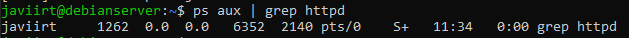

   #### **Respuesta:**
   - `ps aux`: Muestra todos los procesos en ejecución.
   - `grep httpd`: Filtra la salida para mostrar solo los procesos relacionados con `httpd`.
   - `|`: Se usa para redirigir la salida de un comando a otro.
   
   Si `httpd` está en ejecución, el comando mostrará las instancias del proceso. Si no está en ejecución, no habrá salida relevante.

3. **Encuentra el ID de proceso del proceso padre de `httpd` usando `ps axl | egrep "httpd|PPID"`.**

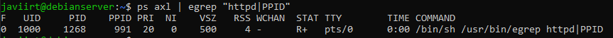

   #### **Respuesta:**
   Ejecutando el comando se puede ver la columna `PPID`, que muestra el ID del proceso padre del servicio Apache.

---

## **Ejercicio 7.3: Creación de archivos HTML**

1. **¿Qué tiene de especial `index.htm` e `index.html`?**

   #### **Respuesta:**
   Son los archivos predeterminados que Apache busca para servir como página de inicio en un directorio.

2. **Verifica los permisos y propiedad del archivo `index.html`.**

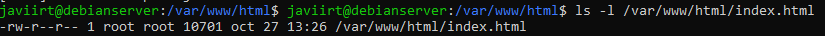

   #### **Respuesta:**
   Se puede usar el comando `ls -l /var/www/html/index.html` para ver los permisos y la propiedad del archivo.

3. **Creación del archivo `test.html` y predicción de su visualización.**

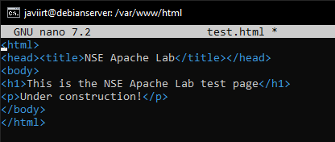

   #### **Respuesta:**
   El archivo `test.html` contendrá un título y un párrafo. Al abrirlo en un navegador, se verá una página con un encabezado y un mensaje de "Under construction!".

---

## **Ejercicio 7.4: Visualización de archivos HTML en la terminal**

1. **Diferencia entre CLI y GUI.**

   #### **Respuesta:**
   - CLI (Command Line Interface): Interfaz basada en texto donde se ingresan comandos.
   - GUI (Graphical User Interface): Interfaz gráfica con ventanas y botones.

2. **¿Qué tiene de especial la dirección IP `127.0.0.1`?**

   #### **Respuesta:**
   Es la dirección de loopback, utilizada para acceder al propio sistema local.

3. **Ver archivo en `lynx` y capturar pantalla.**

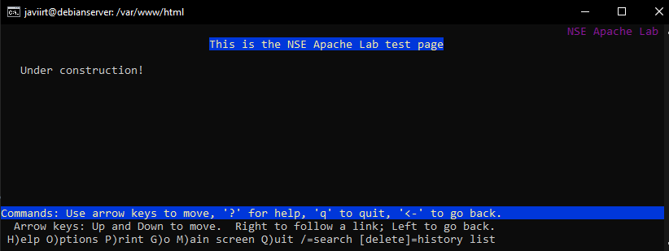

   #### **Respuesta:**
   Ejecutar `lynx 127.0.0.1/test.html` y tomar captura de la pantalla con la página cargada.

 4. **Ver el archivo en un navegador externo.**

   #### **Respuesta:**
   
   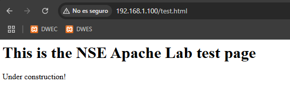

---

## **Ejercicio 7.5: Creación y visualización de archivos PHP**

1. **¿Qué hace `phpinfo();`?**

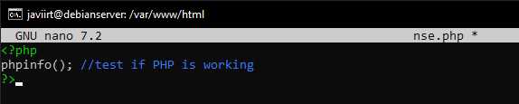

   #### **Respuesta:**
   Muestra información detallada sobre la configuración de PHP en el servidor.

2. **Cargar `nse.php` en `lynx` y capturar pantalla.**

   #### **Respuesta:**
   
   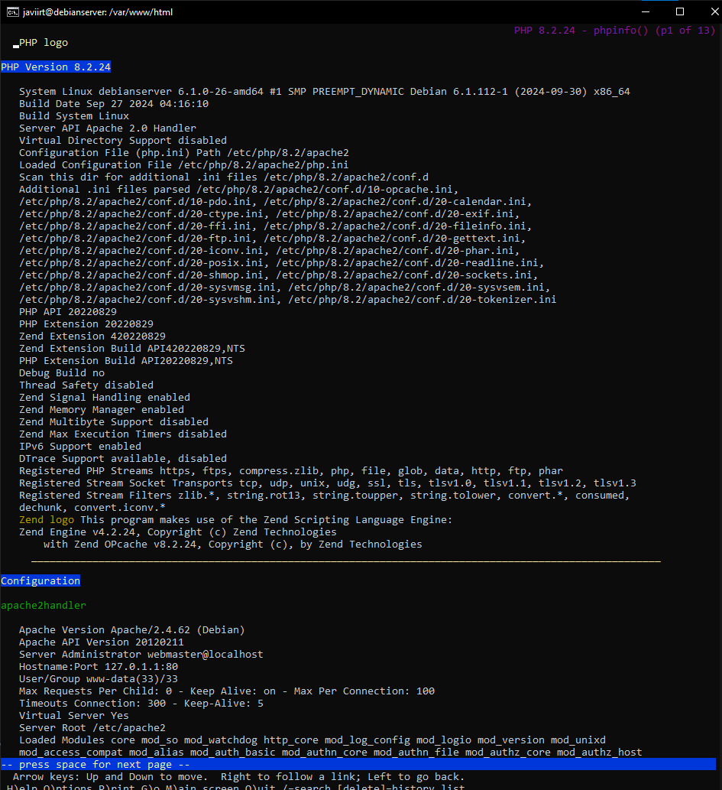

---

## **Ejercicio 7.6: Archivo `hosts`**

1. **Modificar `/etc/hosts` para mapear `ServerName`.**

   #### **Respuesta:**
   
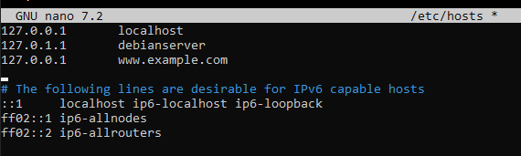

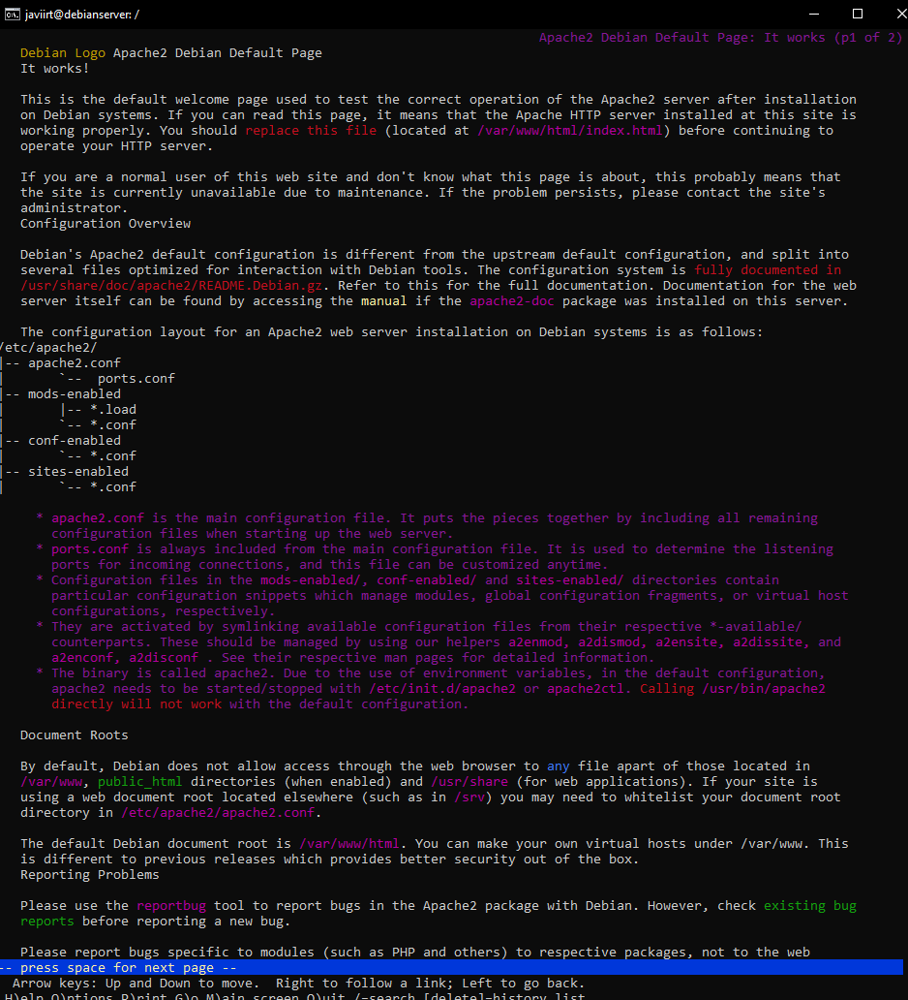

   Agregar `127.0.0.1 www.example.com` al archivo `/etc/hosts`, luego ejecutar `lynx www.example.com`.

