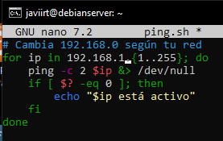
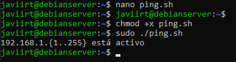

# Lab 9: Network traffic analysis

## Exercise 9.1

###  Create a bash script called ping.sh with the following code, then run it. Press[Ctrl]+[z] to quit the program.
```bash
    #!/bin/bash
    # Change base address 192.168.0 according to your network.
    for ip in 192.168.0.{1..255};
    do
    ping $ip -c 2 &> /dev/null;
    if [ $? -eq 0 ];
    then
    echo $ip is alive
    fi
    done
```

#### Respuesta:





