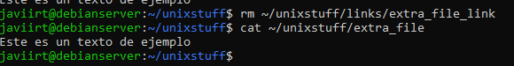

# Lab 10: Further UNIX tools

## Exercise 10.1

###  Before attempting the questions below, you may wish to deliberately reboot the machine and create some failed login attempts so that you have some data to work with. 

1. How many login attempts (successful and failed) occurred in the past 48 hours? 
2. How many system reboots occurred in the past 48 hours?

#### Respuesta:

En las últimas 48 horas, hubo 7 intentos exitosos y 2 intentos fallidos de inicio de sesión, el sistema se ha reiniciado 2 veces;

## Exercise 10.2

###  Before attempting the questions below, you may wish to deliberately reboot the machine and create some failed login attempts so that you have some data to work with. 

1. Create a file ~/unixstuff/extra_file and a symlink ~/unixstuff/links/extra_file_link which links to extra_file (you may need to create the links directory). Use ls -l whilst in ~/unixstuff/links/ to check that the symlink has been created. 

2. Edit extra_file and add some text to it. Now open extra_file_link by executing the following command: cat ~/unixstuff/links/extra_file_link. Do you see the changes you made? 

3. Move extra_file to the backups directory (so its location is now ~/unixstuff/backups/extra_file). 

a) What happens to extra_file_link (if anything)? Hint: try opening the symlink using cat, what is the result? Execute ls -l whilst in ~/unixstuff/links/, do you notice anything different?

b) Move extra_file back to the unixstuff directory – predict what happens to extra_file_link then test your prediction.

4. Delete extra_file_link. What happens to extra_file (if anything – try opening it using cat)? 

5. Recreate the extra_file_link symlink and delete extra_file. What happens to extra_file_link (if anything)? See the hint to question 3 (a) if you are stuck.

6. Delete extra_file_link and redo questions 1 – 5 above, but this time use hard links instead. Hence explain the differences between symbolic and hard links. You might also wish to do some research to explain why you see these differences.

#### Diferencias entre enlaces simbólicos y duros:
Enlace simbólico:

 - Crea un archivo especial que apunta a otro archivo.
 - Puede apuntar a archivos en directorios diferentes.
 - Si el archivo original se elimina o mueve, el enlace simbólico se rompe.

Enlace duro:

 - Crea otro nombre de archivo que apunta al mismo inode del archivo original.
 - No se puede hacer un enlace duro a un directorio.
 - Si el archivo original se elimina, el archivo sigue existiendo si hay otro enlace duro a él.