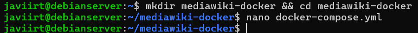
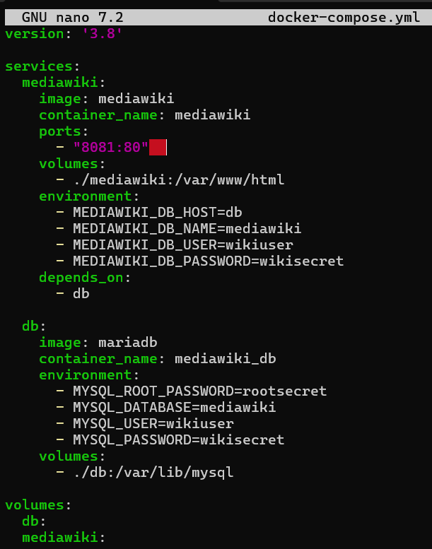
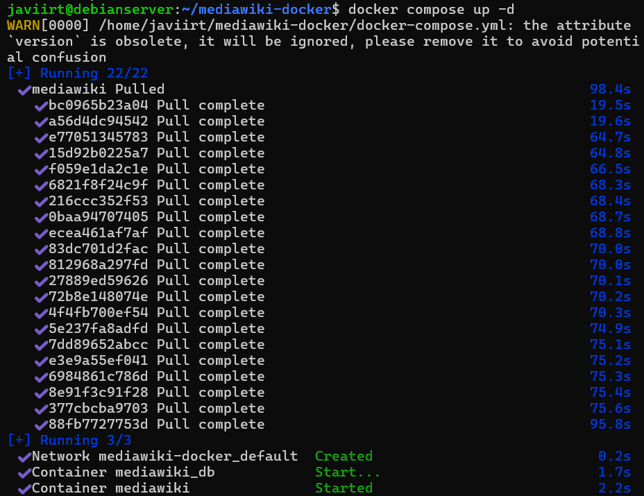
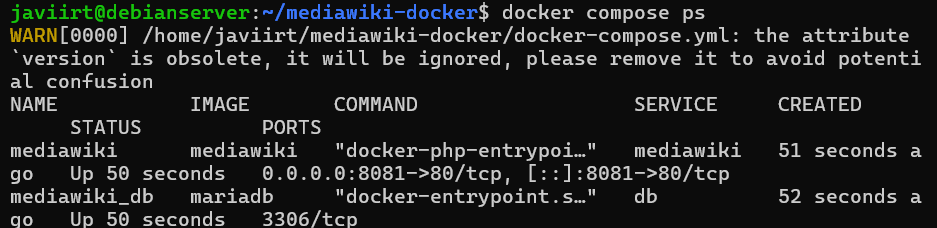
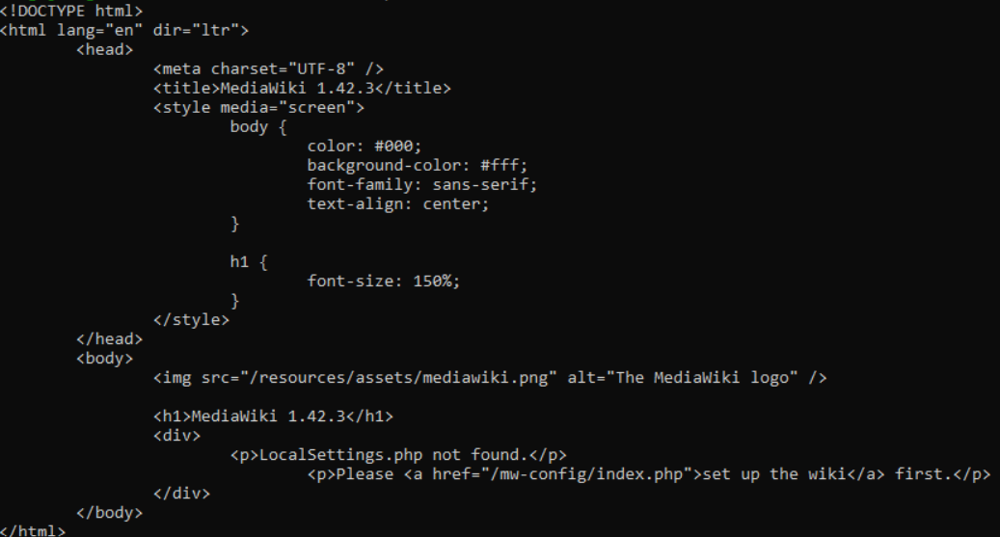
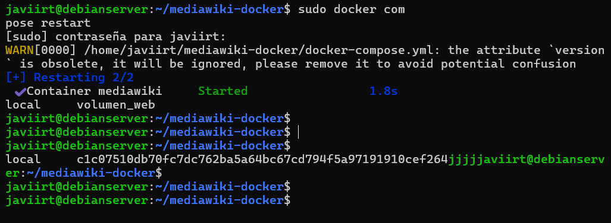

# DOCKERFILE

## Instalar y configurar MediaWiki en un entorno debian utilizando Docker Compose. 

1. Crea una página de prueba en tu MediaWiki.
2. Reinicia los contenedores y verifica que los datos persisten

## Notas:

- Este ejercicio utiliza el seridor en modo de desarrollo.
- Puedes modificar el puerto si el 8080 está ocupado en tu máquina.

### 1. Creo un directorio para el proyecto

### 2. Escribo la siguiente configuración básica en el archivo: 

### 3. Ejecuto Docker Compose para construir y levantar los contenedores

### 4. Verifico que ambos servicios están funcionando

### 5. Comprobamos

### 6. Reiniciamos y comprobamos volumen

